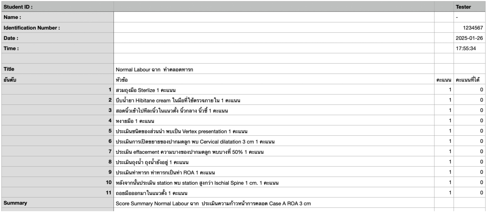
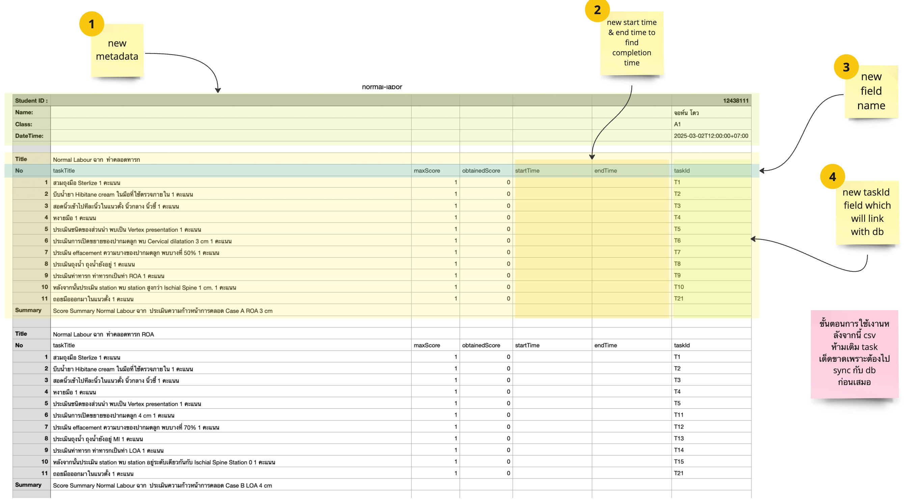

# Template CSV สำหรับ STIN Dashboard
Repository นี้ใช้ในการเก็บ CSV Template สำหรับ STIN Project โดยตัวอย่าง file นี้จะเจาะจงไปที่ วิชาทำคลอดปกติ (normal-labor)

## Original CSV Template
ตัวอย่าง CSV Template ที่ถูกพัฒนามาในตอนต้น โดยปัญหาของ CSV ตัวนี้คือมันเป็น Non-Standard CSV Template ⚠️ ทำให้นำไปใช้งานหรือ reuse ได้ยาก

> Standard CSV Template นั้นคือ template ที่มีโครงสร้างเหมือนกันทั้ง file เป็นตาราง (a simple format for representing a rectangular array (matrix) of numeric and textual values which can called "flat file" format)



## New CSV Template

ตัว template ที่ถูกปรับปรุงใหม่ยังคงไม่ได้แก้ปัญหาเรื่อง Standard Format แต่จะมีการปรับปรุงเพิ่ม header หรือ title บางส่วนเพื่อใช้เป็น break point สำหรับให้ CSV Converter APP ตัวใหม่สามารถทำงานต่อได้



หลักการทำงาน

```
[csv]  --import--> [converter-app] --> [json] --save--> [db] 
```

### สิ่งใหมที่เพิ่มเติม
1. `metadata` ใหม่: format ใหม่สำหรับให้ `converter-app` อ่านข้อมูลได้
2. column ใหม่ `startTime`, `endTime`
3. column name ใหม่: coulumn name ใมห่จะใช้เพื่อเก็บลงใน database จึงควรใช้เป็นภาษาอังกฤษเพื่อนำไปใช้งานต่อในกรณีอื่นๆด้วยเช่นการเชียนสูตร `excel`
4. column ใหม่ `taskId`: column ใหม่นี้เป็น column ที่จะนำมาใช้งานเพื่อเป็น reference กับ database โดยจะสามารถหาค่าตัว taskId นี้ได้จาก file ที่ชื่อ `task_list.csv`

> ⚠️ จากข้อสี่ field `taskId` นั้นเป็น reference สำคัญที่ต้องคอย maintain ทุกครั้งเพราะหากเกิด taskId ใหม่ๆขึ้นกับรายวิชานี้ต้องมีการเพิ่ม task ใหม่นั้นลงใน task_list.csv เสมอ
